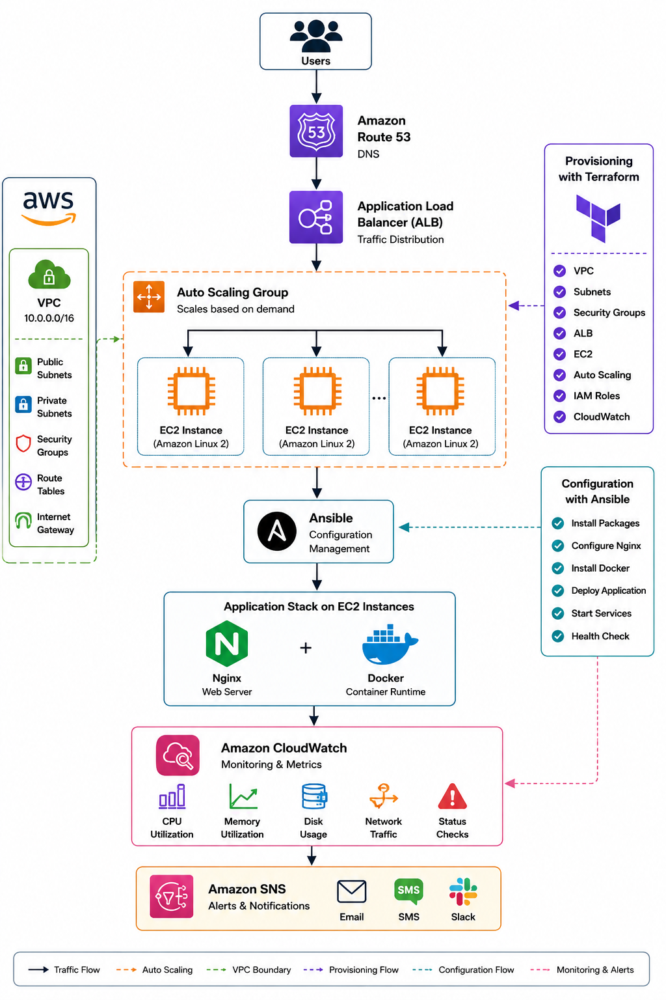

# AWS Terraform Ansible Blueprint

Production-ready AWS Infrastructure Automation using Terraform and Ansible.



---

# Executive Summary

This repository demonstrates a production-grade infrastructure automation pattern for deploying highly available web applications on AWS.

The solution combines Infrastructure as Code (Terraform) and Configuration Management (Ansible) to create a repeatable, scalable, and maintainable deployment workflow.

The architecture is designed around a common enterprise scenario where applications are deployed on EC2 instances behind a load balancer with automated provisioning, configuration, monitoring, and recovery mechanisms.

---

# Business Problem

Many organizations still operate workloads directly on virtual machines.

Common challenges include:

* Manual infrastructure provisioning
* Configuration drift
* Inconsistent environments
* Slow deployments
* Operational overhead
* Limited scalability

As teams grow, these issues create operational risk and reduce engineering productivity.

The objective of this project is to demonstrate how infrastructure automation can improve reliability, consistency, and deployment speed.

---

# Architecture Overview

The solution consists of multiple layers.

```text
Users
   |
Route53
   |
Application Load Balancer
   |
Auto Scaling Group
   |
+-----+-----+-----+
| EC2 | EC2 | EC2 |
+-----+-----+-----+
      |
   Ansible
      |
 NGINX + Docker
      |
 CloudWatch
      |
 SNS Alerts
```

---

# Core Components

## Route53

Provides:

* DNS Resolution
* Domain Management
* Traffic Routing

Route53 acts as the public entry point into the platform.

---

## Application Load Balancer

The Application Load Balancer distributes incoming traffic across multiple EC2 instances.

Responsibilities:

* Load Balancing
* Health Checks
* SSL Termination
* High Availability

Unhealthy instances are automatically removed from service.

---

## Auto Scaling Group

Auto Scaling Groups maintain desired application capacity.

Benefits:

* Automatic recovery
* Elastic scaling
* Improved availability

If an EC2 instance fails, AWS automatically launches a replacement.

---

## EC2

Application workloads execute on Amazon EC2.

Responsibilities:

* Docker runtime
* Application hosting
* NGINX reverse proxy

This repository demonstrates traditional infrastructure automation patterns that remain widely used in production environments.

---

## Ansible

Ansible performs server configuration and application deployment.

Tasks include:

* Operating system updates
* Docker installation
* NGINX installation
* Service configuration
* Application deployment

This ensures configuration consistency across all servers.

---

## CloudWatch

CloudWatch provides operational visibility.

Metrics monitored:

* CPU Utilization
* Memory Utilization
* Disk Usage
* Network Throughput
* Instance Health

Monitoring enables proactive operations and incident detection.

---

## SNS

SNS distributes operational notifications.

Examples:

* High CPU Alerts
* Instance Failures
* Deployment Failures

This improves incident response time.

---

# Why Terraform?

Terraform provides Infrastructure as Code.

Benefits:

* Version-controlled infrastructure
* Reproducible environments
* Automated provisioning
* Reduced manual errors

Infrastructure becomes a deployable asset rather than a manual process.

---

# Why Ansible?

Terraform provisions infrastructure.

Ansible configures infrastructure.

Examples:

Terraform:

* Create VPC
* Create EC2
* Create ALB
* Create Security Groups

Ansible:

* Install NGINX
* Install Docker
* Configure Applications
* Manage Services

The combination provides complete infrastructure automation.

---

# Repository Structure

```text
aws-terraform-ansible-blueprint

├── architecture
├── terraform
├── ansible
├── docs
├── runbooks
└── interview-prep
```

---

# Infrastructure Automation Workflow

The deployment process follows these stages:

1. Infrastructure definitions stored in GitHub
2. Terraform validates configuration
3. Terraform provisions AWS infrastructure
4. Ansible configures EC2 instances
5. Applications deployed through automation
6. Monitoring activated
7. Alerts configured

This process ensures consistent and repeatable deployments.

---

# Operational Capabilities

The platform includes:

### High Availability

Application Load Balancer and Auto Scaling Groups improve resilience.

### Scalability

Infrastructure scales based on workload demand.

### Monitoring

CloudWatch provides infrastructure visibility.

### Incident Response

Runbooks provide structured troubleshooting procedures.

### Security

IAM, Security Groups, and network isolation provide defense-in-depth.

---

# Documentation

The repository includes:

### Architecture

* Architecture Overview
* Design Decisions

### AWS Services

* Route53
* ALB
* EC2
* IAM
* CloudWatch
* SNS

### Operations

* Deployment Failures
* High CPU Investigation
* EC2 Connectivity Issues

### Interview Preparation

* Terraform Questions
* Ansible Questions
* Infrastructure Automation Concepts

---

# Learning Outcomes

This project demonstrates practical experience with:

* AWS Infrastructure
* Terraform
* Ansible
* Linux Administration
* NGINX
* Docker
* Monitoring
* Scaling
* Incident Response

The repository is intended as both a learning resource and a reference implementation for infrastructure automation on AWS.

---

# Future Enhancements

Potential future improvements include:

* GitHub Actions Integration
* Blue-Green Deployments
* Infrastructure Testing
* AWS Systems Manager
* Multi-Region Disaster Recovery
* Security Scanning
* Cost Optimization Dashboards

---

# Conclusion

Infrastructure automation is a foundational capability for modern engineering teams.

This repository demonstrates how Terraform and Ansible can be combined to provision, configure, and operate AWS infrastructure in a predictable and repeatable manner while supporting scalability, reliability, and operational excellence.
